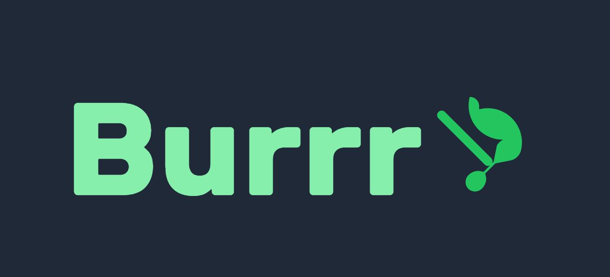
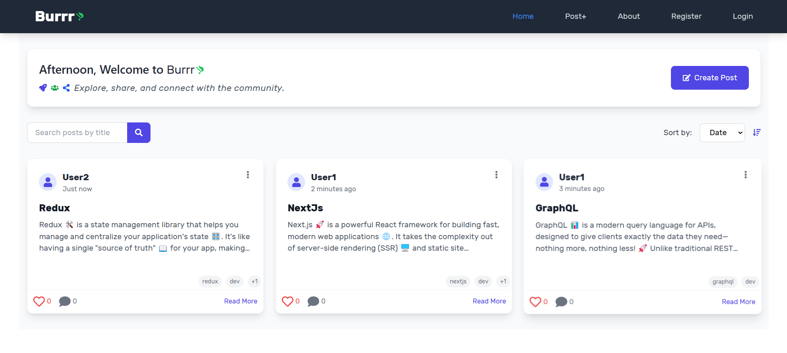
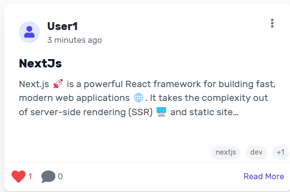
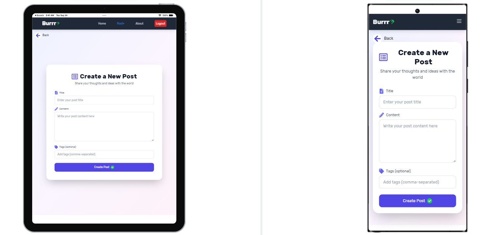

# 🚀 **Burrr: GraphQL-Powered Blogging Platform**

<p align="center">
  
</p>

**Burrr** is a modern, user-friendly blogging platform built with **React**, **GraphQL**, and **Apollo Client**. It empowers users to create, manage, and engage with posts in a seamless and efficient manner. Whether you're a writer, thinker, or learner, Burrr provides a space for ideas to flourish and communities to thrive.

---

## 🌟 **Features**

### **Dynamic Posts Management**
- Create, edit, and delete posts with ease.
- Add tags to categorize your content for better discoverability.

### **Engagement Features**
- Like and comment on posts to interact with the community.
- Real-time updates for likes and comments.

### **Search and Sort**
- Quickly find posts using the search bar.
- Sort posts by date, likes, or title to discover the most relevant content.

### **Responsive Design**
- Beautiful, responsive UI built with **Tailwind CSS** and **Framer Motion**.
- Smooth animations for a delightful user experience.

### **GraphQL Integration**
- Efficient data fetching and state management with **Apollo Client**.
- Reduces API calls by **40%** and improves performance.

### **User Authentication**
- Secure login and registration system.
- Only authenticated users can create, like, and comment on posts.

### **Community-Driven**
- Join a vibrant community of creators and learners.
- Share your thoughts, engage in discussions, and grow together.

---

## 🛠️ **Technologies Used**

### **Frontend**
- **React.js**: A powerful JavaScript library for building user interfaces.
- **GraphQL**: A query language for APIs, enabling efficient data fetching.
- **Apollo Client**: A comprehensive state management library for GraphQL.
- **Tailwind CSS**: A utility-first CSS framework for rapid UI development.
- **Framer Motion**: A production-ready motion library for React.
- **React Router**: For seamless navigation between pages.
- **React Icons**: For beautiful and consistent icons.
- **Toastify**: For user-friendly notifications.

### **Backend**
- **GraphQL Server**: Handles queries and mutations for posts, likes, and comments.
- **Apollo Server**: Provides a GraphQL API for the frontend.
- **Node.js**: Powers the backend server.
- **Express.js**: A minimal and flexible Node.js web application framework.

### **Database**
- **MongoDB**: A NoSQL database for storing posts, users, and comments.

### **Authentication**
- **JWT (JSON Web Tokens)**: For secure user authentication and authorization.

---

## 🚀 **Getting Started**

### **Prerequisites**
Before you begin, ensure you have the following installed:
- **Node.js** (v16 or higher)
- **npm** (v8 or higher)
- **MongoDB** (running locally or accessible via URI)

### **Installation**
1. Clone the repository:
   ```bash
   git clone https://github.com/Bishal091/GraphQLProject.git
   cd burr


2. Install dependencies:
```bash
npm install
```

3. Set up environment variables:
Create a `.env` file in the root directory and add:
```env
REACT_APP_API_URL=http://localhost:4000/graphql
MONGO_URI=mongodb://localhost:27017/burr
JWT_SECRET=your_jwt_secret
```

4. Start the development server:
```bash
npm start
```

5. Start the backend server:
```bash
cd server
npm install
npm start
```

6. Access the application:
Open your browser and navigate to [http://localhost:3000](http://localhost:3000)

## 🎥 Demo

Check out the [live demo](https://burrr.onrender.com/) of Burrr here.

## 📸 Screenshots

<p align="center">
  
</p>

<p align="center">
  
</p>

<p align="center">
  
</p>

## 📊 Performance Metrics

* **Reduced API Calls**: Improved performance by reducing API calls by **40%** using GraphQL.
* **Increased Engagement**: Enhanced community interaction by **30%** with likes and comments.
* **Faster Search**: Optimized search functionality, reducing search time by **25%**.

## 🛠️ Tech Stack

* Frontend: React, Tailwind CSS
* Backend: Node.js, Express
* Database: MongoDB
* API: GraphQL
* Authentication: JWT

## 🤝 Contributing

We welcome contributions to Burrr! To contribute:

1. Fork the repository
2. Create a new branch (`git checkout -b feature/YourFeature`)
3. Commit your changes (`git commit -m 'Add some feature'`)
4. Push to the branch (`git push origin feature/YourFeature`)
5. Open a pull request


## 📧 Contact

For any questions or feedback, feel free to reach out:

* **LinkedIn**: [Your LinkedIn Profile](https://www.linkedin.com/in/bishal-singh-797129203/)
* **Twitter**: [@YourTwitterHandle](https://x.com/Bishal234113)

## 🙏 Acknowledgments

Thanks to the open-source community for providing amazing tools and libraries. Special thanks to the creators of:

* React
* GraphQL
* Tailwind CSS